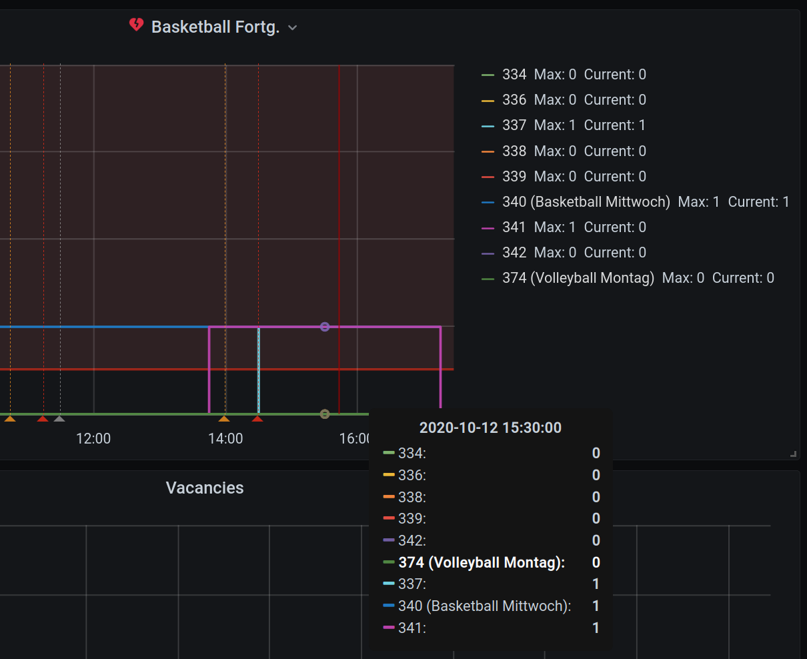
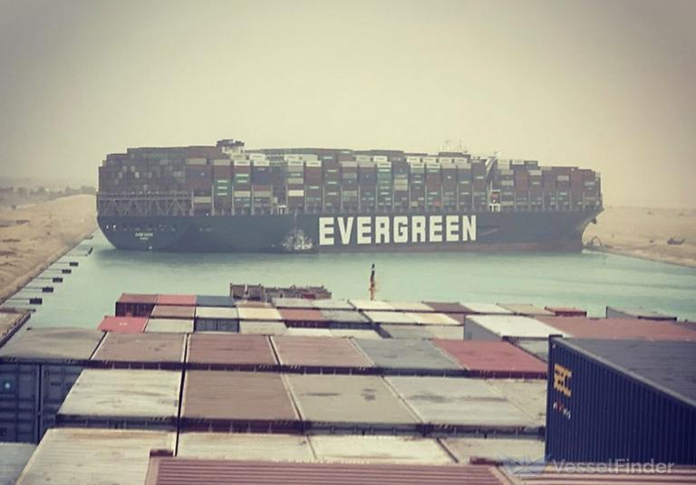
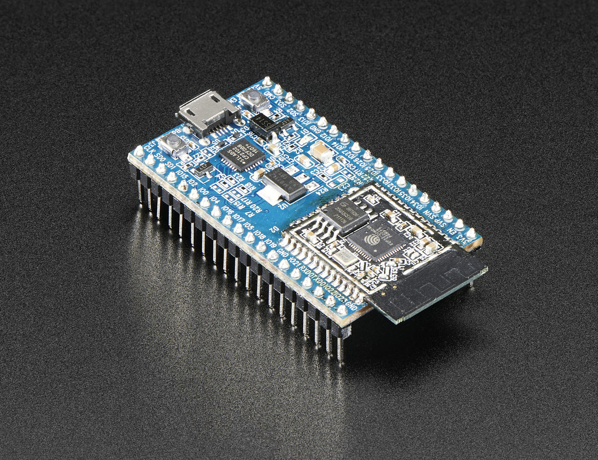
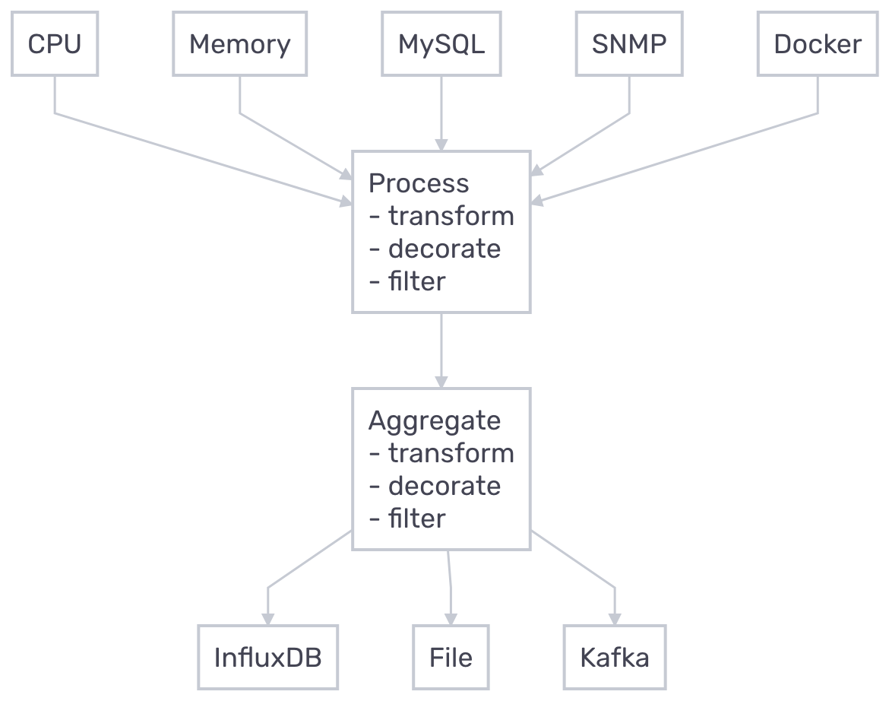
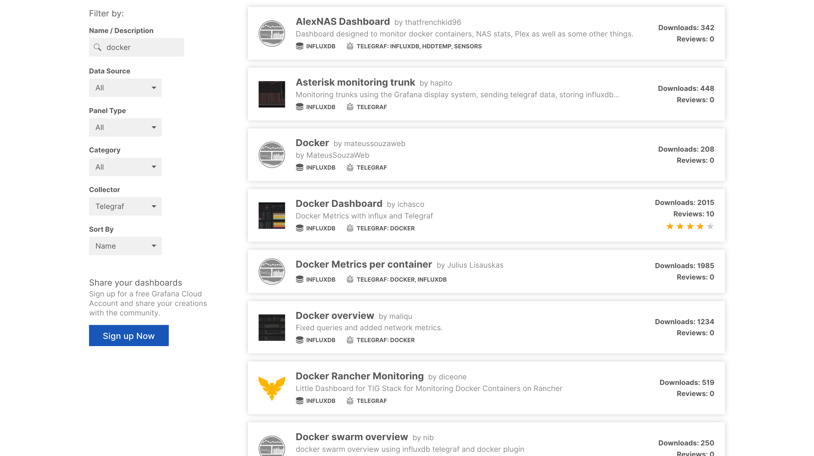
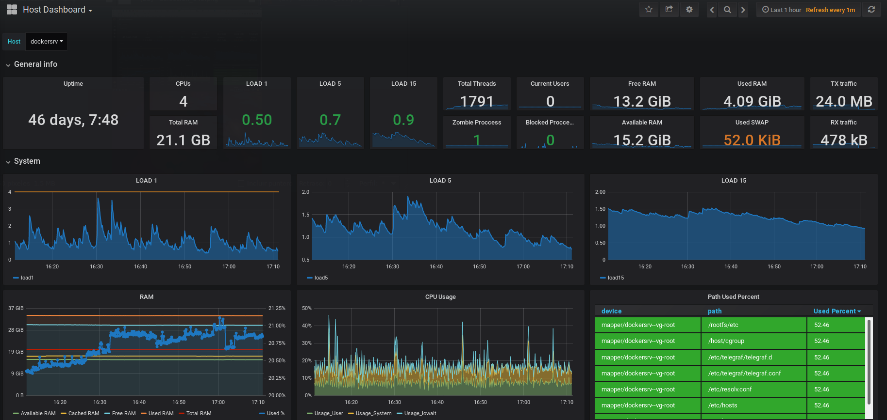
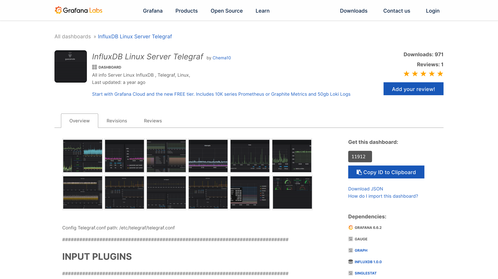
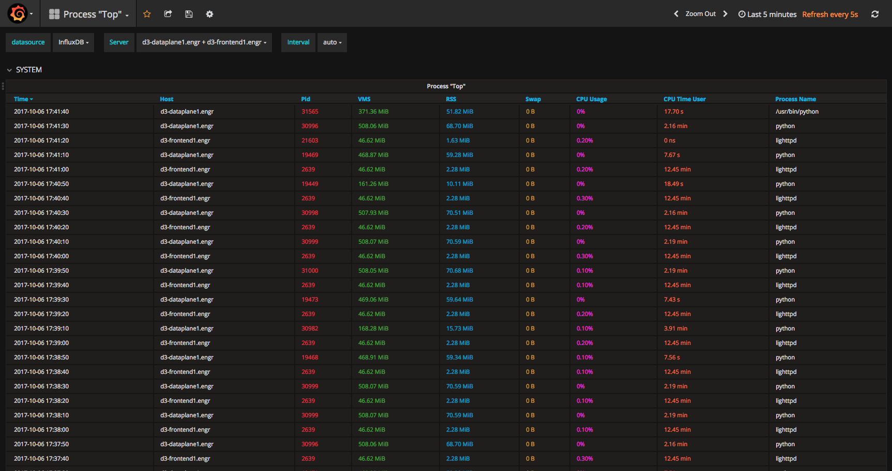

# Gotta Collect 'Em All
#### Metrics Easily Visualised

<!-- ### Follow this live

<a href="https://glt21.thym.at">https://glt21.thym.at</a>

-->

---

## Who am I?

- Student at Graz University of Technology 🎓
- System Analyst at BearingPoint 🌿
- Linux experience of about 6 years 💻
- Previously HW/SW-Developer and SysAdmin 🌱
- Likes to play Basketball 🏀

---

## How I got into my sports courses?

<a class="navigate-right">
    
</a>

---

## What happened after?

<a class="navigate-right">
    
</a>

---

## Why even collect metrics?

<a class="navigate-right">
    
</a>

--

### Provide system health overview

- View uptime and status
- Explore usage stats (CPU, RAM, Disk I/O etc.)
- Examine Package update status
- Verify network health

--

### Avoid disasters

- Monitor critical processes and jobs
- View disk usage
- Check backup status

<a class="navigate-down">
    
</a>

--

### Prevent disk failure

- Observe S.M.A.R.T results
- Track temperatures

<a class="navigate-down">
    
</a>

--

### Collect IoT data

- Gather IoT sensor readings
- Probe webserver status

<a class="navigate-right">
    
</a>

---

## What is Telegraf?

- Free Open Source Software
- Metrics Agent
- Written in Go
- Plugin-driven

---

## Why would you want to use it?

- Single binary
- Minimal memory footprint
- High flexibility
- Straightforward setup

---

## How can it be deployed?

- Binary
- Ansible role
- Docker container
- Kubernetes deployment

---

## Let's see some examples!

---

### Basic Configuration

```
telegraf --input-filter cpu --output-filter influxdb config
```

<a class="navigate-right">
    
</a>

---

### Plugin Configuration

<a class="navigate-right">
    
</a>


--

### Input Plugins

- Sensors (lm_sensors)
- S.M.A.R.T.
- HTTP response
- X.509 Certificate
- Wireguard
- Minecraft scoreboard
- YouTube

--

### Example Input Plugins

<a class="navigate-right">
    
</a>

--

### Even More Input Plugins

- Octoprint API
- OpenWeatherMap
- PostgreSQL/MySQL queries
- Proxmox API
- MQTT Consumer
- Octoprint API
- CS:GO server statistics
- many more ...

--

## Aggregator and Processor Plugins

<!--

### Aggregator Plugins

- BasicStats
- Final
- Histogram
- Merge
- MinMax
- ValueCounter

### Processor Plugins

- Processor Plugin:
- Converter
- Clone
- Date
- Dedup
- Filepath
- Regex
- Rename
- Strings

-->

--

### Output Plugins

- InfluxDB
- Exec
- File
- Prometheus
- MQTT Producer

---

### Docker Compose Setup

<a class="navigate-down">
    
</a>

--

### Docker Images

```
docker pull telegraf
```

```
docker pull telegraf:1.18
```

```
docker pull telegraf:1.18-alpine
```

---

## Docker Container Monitoring

--

### Docker Input Plugin

<a class="navigate-down">
    
</a>

--

### Dashboard Search

<a class="navigate-down">
    
</a>

--

### Docker Dashboard

<a class="navigate-right">
    
</a>

---

### Environment Variables

<a class="navigate-down">
    
</a>

---

## Linux System Monitoring

--

### System Input Plugins

<a class="navigate-down">
    
</a>

--

### Host Overview Dashboard

<a class="navigate-right">
    
</a>

---

### More dashboards

<a class="navigate-right">
    
</a>

---

### Simulating top

<a class="navigate-right">
    
</a>

---

### Mentioned resources

- <a href="https://github.com/influxdata/telegraf">Telegraf</a> - GitHub repository
- <a href="https://portal.influxdata.com/downloads/">Telegraf</a> - Downloads page
- <a href="https://docs.influxdata.com/telegraf/v1.18/plugins/">Telegraf</a> - Plugin overview
- <a href="https://www.influxdata.com/products/integrations/">InfluxDB and Telegraf integrations</a>
- <a href="https://nwmichl.net/2020/07/14/telegraf-influxdb-grafana-on-raspberrypi-from-scratch/">TIG stack on Raspberry Pi</a>
- <a href="https://github.com/totoroot/tig-stack">TIG stack with Docker Compose</a>

--

### Mentioned resources

- <a href="https://grafana.com/grafana/dashboards?collector=Telegraf&dataSource=influxdb&pg=dashboards&search=docker">Grafana</a> - Dashboard search
- <a href="https://grafana.com/grafana/dashboards/10585">Grafana</a> - Docker dashboard by 'ichasco'
- <a href="https://grafana.com/grafana/dashboards/10585">Grafana</a> - Host overview dashboard by 'ichasco'
- <a href="https://grafana.com/grafana/dashboards/11912">Grafana</a> - Linux server dashboard by 'Chema10'
- <a href="https://grafana.com/grafana/dashboards/3387">Grafana</a> - Simulating top 
- <a href="https://www.influxdata.com/integration/mqtt-monitoring/">Telegraf MQTT integration</a> - Video tutorial

---

### Attributions

- Metrics - Photo by <a href="https://unsplash.com/@lukechesser?utm_source=unsplash&utm_medium=referral&utm_content=creditCopyText">Luke Chesser</a> on <a href="https://unsplash.com/s/photos/metrics?utm_source=unsplash&utm_medium=referral&utm_content=creditCopyText">Unsplash</a>
- Hard disk - Photo by <a href="https://unsplash.com/@redaquamedia?utm_source=unsplash&utm_medium=referral&utm_content=creditCopyText">Denny Müller</a> on <a href="https://unsplash.com/s/photos/hard-disk?utm_source=unsplash&utm_medium=referral&utm_content=creditCopyText">Unsplash</a>
- Container ship - Photo from <a href="https://www.vesselfinder.com/ship-photos/693046">VesselFinder</a>
- IoT device - <a href="https://www.flickr.com/photos/35434449@N08/29834681185">Espressif ESP32 Development Board - Developer Edition</a> by <a href="https://www.flickr.com/photos/35434449@N08">adafruit</a> is licensed under <a href="https://creativecommons.org/licenses/by-nc-sa/2.0/?ref=ccsearch&atype=rich">CC BY-NC-SA 2.0</a>

--

### Attributions
- <a href="https://revealjs.com/">reveal.js</a> - HTML presentation framwork
- <a href="https://carbon.now.sh/">carbon-now</a> - Source code images

---

# Thanks!

curl -sL <a href="https://matthias.thym.at">https://matthias.thym.at</a>/card \
\
<a href="https://blog.thym.at/p/glt21">https://blog.thym.at/p/glt21/</a>
